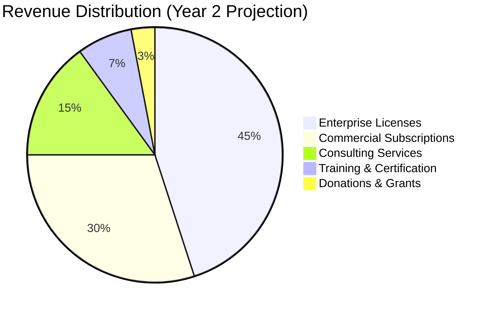

# Paradox Loop CAPTCHA - Open Source Sustainability Plan

## 🎯 Mission Statement

**Ensure long-term viability of Paradox Loop CAPTCHA as a community-driven, privacy-first alternative to surveillance-based CAPTCHAs while maintaining financial sustainability for core development.**

## 💰 Revenue Model

### 1. Open Core Strategy

#### Free Tier (AGPLv3)
- ✅ Core paradox engine
- ✅ Basic challenge types
- ✅ Standard themes
- ✅ Community support
- ✅ Self-hosted deployment

#### Commercial License ($99-$999/month)
- ✅ Closed-source modifications allowed
- ✅ Priority support (24h response)
- ✅ Custom themes and branding
- ✅ Advanced analytics dashboard
- ✅ SLA guarantees
- ✅ On-premise deployment assistance

#### Enterprise Solutions (Custom Pricing)
- ✅ White-label solutions
- ✅ Custom paradox development
- ✅ Dedicated support engineer
- ✅ Advanced threat intelligence
- ✅ Integration consulting
- ✅ Training workshops

### 2. Sustainable Revenue Streams



#### Revenue Projections
```
Year 1: $180,000
- 50 commercial licenses × $99/month = $59,400
- 8 enterprise clients × $1,500/month = $144,000
- Consulting: $36,000

Year 2: $450,000  
- 125 commercial licenses × $99/month = $148,500
- 18 enterprise clients × $1,500/month = $324,000
- Consulting: $72,000
- Training programs: $54,000

Year 3: $850,000
- 200 commercial licenses × $149/month = $357,600
- 35 enterprise clients × $1,200/month = $504,000
- Consulting: $120,000
- Training & certification: $108,000
```

## 👥 Community Building Strategy

### 1. Governance Structure

#### Core Team (3-5 people)
- **Lead Maintainer**: Project vision, final decisions
- **Security Lead**: Threat modeling, vulnerability assessment  
- **UX Lead**: Accessibility, user experience
- **Community Manager**: Documentation, support, outreach

#### Advisory Board (7-9 people)
- Security researchers
- Accessibility experts
- Privacy advocates
- Open source sustainability experts
- Enterprise users

#### Community Contributors
- **Challenge Creators**: Submit new paradox types
- **Security Researchers**: Report vulnerabilities
- **Integration Developers**: Framework adapters
- **Documentation Writers**: Guides, tutorials, translations

### 2. Contribution Framework

#### Recognition System
```
Contribution Level | Requirements | Benefits
-------------------|--------------|----------
Bronze Contributor | 5+ merged PRs | Name in credits
Silver Contributor | 20+ PRs + documentation | Beta access
Gold Contributor   | Major feature + mentoring | Conference speaking
Platinum Advisor   | Sustained leadership | Advisory board seat
```

#### Bounty Program
```
Vulnerability Type | Reward | Requirements
-------------------|---------|-------------
Critical Security  | $5,000  | RCE, auth bypass
High Security      | $2,500  | DoS, data leak
Medium Security    | $1,000  | Logic flaws
Low Security       | $500    | Info disclosure
Challenge Ideas    | $100    | Novel paradox types
Documentation      | $50     | Comprehensive guides
```

## 🔄 Development Sustainability

### 1. Technical Roadmap Funding

#### Year 1 Priorities ($120,000 budget)
- **Core Development** (60%): $72,000
  - Advanced challenge algorithms
  - Performance optimization
  - Security hardening
- **Documentation** (20%): $24,000
  - API documentation
  - Integration guides
  - Video tutorials
- **Community Tools** (20%): $24,000
  - Contributor platform
  - Testing infrastructure
  - Issue triage automation

#### Year 2-3 Expansion ($200,000/year budget)
- **Research & Innovation** (40%): $80,000
  - Quantum-resistant algorithms
  - Zero-knowledge proofs
  - Advanced AI resistance
- **Platform Development** (35%): $70,000
  - Mobile SDKs
  - Cloud services
  - Enterprise features
- **Community Growth** (25%): $50,000
  - Conference presence
  - Educational content
  - Partnerships

### 2. Quality Assurance

#### Automated Testing Pipeline
- **Unit Tests**: 95%+ coverage requirement
- **Integration Tests**: Cross-platform compatibility
- **Security Scans**: Daily vulnerability assessment
- **Performance Tests**: Load testing, stress testing
- **Accessibility Tests**: WCAG 2.2 compliance automation

#### Manual Review Process
- **Code Review**: 2+ approvals for core changes
- **Security Review**: Dedicated review for security-critical changes
- **UX Review**: Accessibility and usability assessment
- **Documentation Review**: Technical accuracy and clarity

## 🌍 Community Ecosystem

### 1. Partner Network

#### Integration Partners
- **Frameworks**: React, Vue, Angular, Django, Rails
- **Platforms**: WordPress, Shopify, Magento
- **Services**: Auth0, Firebase, Supabase

#### Research Partnerships
- **Universities**: MIT, Stanford, UC Berkeley
- **Organizations**: OWASP, Privacy Foundation
- **Conferences**: DEF CON, Black Hat, RSA

### 2. Educational Initiatives

#### Developer Education
- **Workshop Series**: Monthly technical deep-dives
- **Certification Program**: Paradox CAPTCHA implementation certification
- **Academic Curriculum**: University course materials

#### Content Strategy
- **Technical Blog**: Weekly posts on security, philosophy, UX
- **Video Series**: YouTube channel with tutorials
- **Podcast**: "The Paradox Papers" - interviews with experts

## 📈 Growth Metrics & KPIs

### Community Health
```
Metric                    | Current | 6-Month Goal | 1-Year Goal
--------------------------|---------|--------------|-------------
GitHub Stars              | 2,500   | 10,000       | 25,000
Active Contributors       | 12      | 50           | 150
Discord Members           | 340     | 2,000        | 8,000
Monthly Downloads         | 15K     | 100K         | 500K
Documentation Page Views  | 8K      | 50K          | 200K
```

### Financial Sustainability
```
Metric                | Year 1 | Year 2 | Year 3
----------------------|--------|--------|--------
Monthly Recurring Revenue | $15K   | $37K   | $71K
Enterprise Contracts      | 8      | 18     | 35
Break-even Month         | Month 8| Month 3| Month 1
Developer Productivity   | 2 FTE  | 4 FTE  | 7 FTE
```

## 🛡️ Risk Mitigation

### Technical Risks

#### AI Evolution Risk
- **Risk**: Advanced AI models overcome paradox traps
- **Mitigation**: 
  - Continuous research partnership with universities
  - Adaptive challenge generation system
  - Community-driven challenge creation pipeline

#### Security
