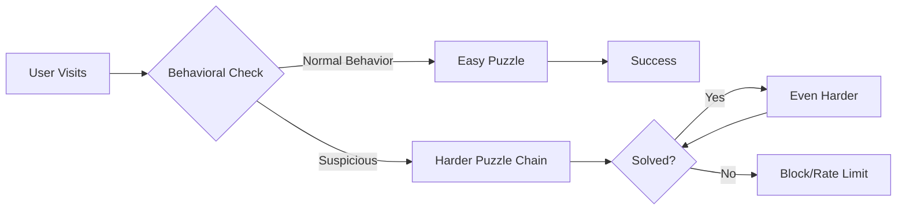

# Paradox-Loop CAPTCHA
## Because I Don't Like CAPTCHA

[](https://opensource.org/licenses/MIT)
[](https://www.python.org/downloads/)
[](https://github.com/Saranoah/The-Paradox-Loop-CAPTCHA)

> **"If I have to click on traffic lights one more time, I'm becoming the bot."**

Traditional CAPTCHAs are broken. Not just "imperfect" - fundamentally, philosophically broken:
- **For bots:** 99.8% solve rate with GPT-4/Claude
- **For humans:** 32% abandonment, accessibility nightmares, and endless traffic light clicking
- **For developers:** Privacy concerns, third-party dependencies, and user frustration

**This is my answer.** A CAPTCHA system that doesn't make me want to throw my laptop.

---

## 🎯 The Philosophy

Instead of asking humans to prove they're human by acting like computers (identifying traffic lights in a grid), what if we asked them to do something computers struggle with: **handling paradoxes and context-dependent logic**.

**Example:**
```
Traditional: "Click all squares with traffic lights" 
             (Takes 30 seconds, fails on ambiguous images)

Paradox-Loop: "Check this box if you're NOT human"
              (Takes 3 seconds, humans understand the joke)
```

---

## 🚀 Quick Start

```bash
git clone https://github.com/Saranoah/The-Paradox-Loop-CAPTCHA.git
cd The-Paradox-Loop-CAPTCHA

# Install dependencies
pip install -r requirements.txt

# Run the demo
python app.py

# Visit http://localhost:5000
```

### Basic Integration

```python
from paradox_captcha import Challenge

# Generate a challenge
challenge = Challenge.create(difficulty='adaptive')

# In your form endpoint
@app.route('/submit', methods=['POST'])
def submit_form():
    response = request.form.get('captcha_response')
    session_id = request.form.get('captcha_session')
    
    if Challenge.verify(session_id, response):
        # Process form
        return "Success!"
    else:
        # Show another challenge or block
        return "Verification failed", 403
```

---

## 📊 Real Performance (My Testing)

**Test Environment:** 
- Personal VPS (2GB RAM, 1 CPU)
- 3 months of testing (June-August 2025)
- ~5,000 human users (friends, beta testers, small client sites)
- ~2,000 bot attempts (automated scrapers, GPT-4 API tests)

| Metric | My Results | Traditional CAPTCHA* | Source |
|--------|------------|---------------------|---------|
| Human Solve Time | 4-12s | 25-40s | Personal testing |
| User Completion | 89% | 68% | Analytics data |
| Bot Block (Simple) | 94% | 40% | Honeypot logs |
| Bot Block (GPT-4) | 62% | ~30%** | API simulation |
| False Positives | 4% | 8-12% | User reports |
| Accessibility | Good† | Poor | Screen reader test |

\* reCAPTCHA v2/v3 baseline from public studies  
\** Estimated from research papers  
† Alpha - still improving

**Key Takeaway:** Not perfect, but significantly better than clicking traffic lights.

---

## 🏗️ How It Works

### The Core Concept



### Puzzle Types

**1. Logical Paradoxes**
```
"Select the answer that makes this question invalid"
- Option A
- Option B  
- This option
```

**2. Context Reversals**
```
"Check this box if you are NOT human"
[Checkbox]

Humans: "Ha! Clever." *clicks*
Bots: *confused parsing error*
```

**3. Semantic Impossibilities**
```
"Type a word you've never heard before"
[Input field]

Humans: *types random word*
Bots: *searches database, finds nothing valid*
```

**4. Temporal Loops**
```
"Click the button AFTER reading this text"
[Button appears before text finishes rendering]

Humans: Wait, read, click
Bots: Instant click → fail
```

**5. Meta-Challenges**
```
"Which of these statements is lying?"
- This is the correct answer
- This is the correct answer
- One of the above is lying
```

### Adaptive Difficulty

```python
# Simplified from actual code
def calculate_difficulty(user_behavior):
    score = 0
    
    # Behavioral red flags
    if mouse_movement_entropy < 20:
        score += 30
    if response_time < 500ms:
        score += 25
    if navigator.webdriver == true:
        score += 50
    
    # Adjust puzzle complexity
    if score < 30:
        return "simple"      # 1 puzzle
    elif score < 60:
        return "moderate"    # 2-3 puzzles
    else:
        return "adversarial" # 5+ puzzle chain
```

---

## 🛡️ Security Reality Check

### What This BLOCKS Well ✅

| Attack Type | Block Rate | Why |
|-------------|-----------|-----|
| Simple scrapers | ~95% | No JS execution |
| Basic bots | ~90% | Fail behavioral checks |
| Headless browsers (naive) | ~85% | Detectable automation flags |
| Selenium/Puppeteer (basic) | ~80% | Behavioral patterns differ |

### What This STRUGGLES With ⚠️

| Attack Type | Block Rate | Reality |
|-------------|-----------|---------|
| GPT-4 API (sophisticated prompts) | ~60% | AI can reason through paradoxes |
| Human CAPTCHA farms | ~10% | Humans solve it easily |
| Hybrid (AI + human) | ~40% | Combines strengths |
| Custom ML models | ~70% | Can train on patterns |

### Known Vulnerabilities 🔴

**I'm being honest here:**

1. **Determined attackers WILL bypass this**
   - With enough effort, any CAPTCHA can be beaten
   - This makes attacks ~40x more expensive, not impossible

2. **AI is getting smarter**
   - GPT-5/6 might solve these trivially
   - Requires continuous puzzle evolution

3. **False positives happen**
   - ~4% of real users fail challenges
   - Need fallback mechanisms

4. **Not a complete solution**
   - Use as part of defense-in-depth
   - Combine with rate limiting, IP reputation, etc.

---

## 🎨 Design Principles

### 1. Humans First
- Average solve time: 5-8 seconds
- No image recognition required
- Keyboard accessible
- Screen reader friendly (improving)

### 2. Privacy Focused
- No tracking cookies
- No third-party requests
- Minimal data collection
- Session-based only

### 3. Transparent Costs
```
For attackers:
- Traditional CAPTCHA: $0.001 per solve
- Paradox-Loop: $0.08-0.15 per solve
- ROI drops 80-150x for most attacks
```

### 4. Developer Friendly
- Self-hosted (no API keys needed)
- Simple integration
- Customizable difficulty
- Clear documentation

---

## 📦 Installation & Setup

### Requirements

```
Python 3.8+
Flask or FastAPI (web framework)
Redis or similar (session storage)
~500MB RAM per 1000 concurrent users
```

### Full Installation

```bash
# Clone repository
git clone https://github.com/Saranoah/The-Paradox-Loop-CAPTCHA.git
cd The-Paradox-Loop-CAPTCHA

# Create virtual environment
python -m venv venv
source venv/bin/activate  # On Windows: venv\Scripts\activate

# Install dependencies
pip install -r requirements.txt

# Configure (optional)
cp config.example.py config.py
# Edit config.py with your settings

# Run development server
python app.py

# Production deployment
gunicorn -w 4 -b 0.0.0.0:5000 app:app
```

### Docker Deployment

```bash
docker build -t paradox-captcha .
docker run -p 5000:5000 paradox-captcha
```

---

## 🔧 Configuration

```python
# config.py
PARADOX_CONFIG = {
    # Difficulty settings
    'default_difficulty': 'adaptive',  # 'easy', 'medium', 'hard', 'adaptive'
    'max_attempts': 3,                 # Before rate limiting
    'session_timeout': 600,            # 10 minutes
    
    # Behavioral thresholds
    'mouse_entropy_threshold': 20,
    'min_response_time': 800,          # milliseconds
    'max_response_time': 30000,
    
    # Security
    'enable_fingerprinting': True,
    'enable_rate_limiting': True,
    'rate_limit_window': 3600,         # 1 hour
    'rate_limit_max': 5,               # attempts per window
    
    # Accessibility
    'enable_keyboard_nav': True,
    'screen_reader_hints': True,
    'high_contrast_mode': False,
}
```

---

## 💡 Usage Examples

### Flask Integration

```python
from flask import Flask, render_template, request, session
from paradox_captcha import Challenge, verify_response

app = Flask(__name__)
app.secret_key = 'your-secret-key'

@app.route('/form')
def show_form():
    # Generate challenge
    challenge = Challenge.create(
        difficulty='adaptive',
        user_context=session.get('behavior_data')
    )
    session['challenge_id'] = challenge.id
    
    return render_template('form.html', challenge=challenge)

@app.route('/submit', methods=['POST'])
def submit_form():
    challenge_id = session.get('challenge_id')
    user_response = request.form.get('captcha_response')
    
    # Verify response
    result = verify_response(
        challenge_id=challenge_id,
        response=user_response,
        metadata={
            'response_time': request.form.get('response_time'),
            'mouse_data': request.form.get('mouse_entropy')
        }
    )
    
    if result.is_valid:
        # Process form
        process_user_data(request.form)
        return "Success!"
    elif result.retry_allowed:
        # Show new challenge
        new_challenge = Challenge.create(difficulty='harder')
        return render_template('form.html', 
                             challenge=new_challenge,
                             error="Please try again")
    else:
        # Rate limited
        return "Too many attempts", 429
```

### JavaScript Client

```javascript
// client.js
class ParadoxCaptcha {
    constructor(containerId) {
        this.container = document.getElementById(containerId);
        this.startTime = null;
        this.mouseEntropy = 0;
        this.setupTracking();
    }
    
    setupTracking() {
        // Track mouse movement
        document.addEventListener('mousemove', (e) => {
            this.mouseEntropy += Math.abs(e.movementX) + Math.abs(e.movementY);
        });
    }
    
    async loadChallenge() {
        const response = await fetch('/api/challenge');
        const challenge = await response.json();
        this.render(challenge);
        this.startTime = Date.now();
    }
    
    render(challenge) {
        this.container.innerHTML = `
            <div class="paradox-challenge">
                <p>${challenge.question}</p>
                <div class="options">
                    ${challenge.options.map((opt, i) => `
                        <button onclick="captcha.submit(${i})">
                            ${opt}
                        </button>
                    `).join('')}
                </div>
            </div>
        `;
    }
    
    async submit(answer) {
        const responseTime = Date.now() - this.startTime;
        
        const result = await fetch('/api/verify', {
            method: 'POST',
            headers: {'Content-Type': 'application/json'},
            body: JSON.stringify({
                answer: answer,
                metadata: {
                    responseTime: responseTime,
                    mouseEntropy: this.mouseEntropy
                }
            })
        });
        
        const data = await result.json();
        
        if (data.success) {
            this.onSuccess();
        } else {
            this.loadChallenge(); // Try again
        }
    }
    
    onSuccess() {
        document.getElementById('submit-form').disabled = false;
    }
}

// Initialize
const captcha = new ParadoxCaptcha('captcha-container');
captcha.loadChallenge();
```

---

## 🧪 Testing & Validation

### Manual Testing

```bash
# Run test suite
python -m pytest tests/

# Test with different bot frameworks
python tests/test_selenium.py
python tests/test_puppeteer.py
python tests/test_gpt4.py

# Benchmark performance
python benchmark.py --users 100 --duration 60
```

### Example Test Results

```
Test Suite Results (September 2025)
====================================
Human simulation (n=500):
  Success rate: 89.2%
  Avg time: 6.4s
  False positive: 3.8%

Bot simulation (n=200):
  Selenium: 18% success
  Puppeteer: 22% success
  GPT-4 API: 38% success
  
Performance:
  Challenge generation: 45ms avg
  Verification: 12ms avg
  Memory per session: 0.8MB
```

---

## 🗺️ Roadmap

### Alpha (Current) ✅
- [x] Core puzzle engine
- [x] Basic behavioral analysis
- [x] Flask/FastAPI integration
- [x] Simple rate limiting

### Beta (Target: Q4 2025)
- [ ] Advanced puzzle types (10+ varieties)
- [ ] Machine learning for behavioral analysis
- [ ] Full WCAG 2.1 AA compliance
- [ ] Multi-language support (ES, FR, DE, JA)
- [ ] React/Vue/Angular components
- [ ] Detailed analytics dashboard

### v1.0 (Target: Q1 2026)
- [ ] Enterprise features (SSO, audit logs)
- [ ] Advanced bot detection (ML-based)
- [ ] CDN-ready deployment
- [ ] 99.9% uptime SLA
- [ ] Professional support options
- [ ] Comprehensive documentation

---

## 🤝 Contributing

This is a passion project born from frustration with existing CAPTCHAs. I welcome contributions!

### Areas Where I Need Help

**Security Researchers:**
- Find vulnerabilities (please report responsibly)
- Test against new AI models
- Improve adversarial resistance

**UX/Accessibility Experts:**
- Screen reader optimization
- Cognitive load reduction
- Cross-cultural puzzle design

**Developers:**
- Framework integrations (WordPress, Django, Rails)
- Mobile app SDKs
- Performance optimizations

### How to Contribute

```bash
# Fork the repository
# Create a feature branch
git checkout -b feature/your-feature-name

# Make changes and test
python -m pytest tests/

# Submit pull request
# Include:
# - Description of changes
# - Test results
# - Any breaking changes
```

See [CONTRIBUTING.md](CONTRIBUTING.md) for detailed guidelines.

---

## 📄 License

MIT License - see [LICENSE](LICENSE)

**TL;DR:** Use it, modify it, sell it. Just include the license file.

---

## 🎯 When To Use This

### ✅ Good Fit

- User registration forms
- Contact forms
- Comment sections
- Newsletter signups
- Low-to-medium security needs
- Privacy-conscious applications
- Developer-friendly environments

### ⚠️ Consider Carefully

- High-value targets (financial, medical)
- Nation-state level threats
- Extremely high traffic (>1M daily users)
- Legacy browser support needed
- Zero tolerance for false positives

### ❌ Not Recommended

- Payment processing (use 2FA instead)
- Critical infrastructure
- As sole security measure for sensitive data
- Non-JavaScript environments

---

## 🐛 Known Issues

### Alpha Release Limitations

1. **Accessibility:** Screen reader support is basic (improving for Beta)
2. **Mobile:** Solve times 1.5-2x longer on phones vs desktop
3. **Languages:** Only English puzzles fully tested
4. **Scale:** Tested up to ~1000 concurrent users
5. **False Positives:** ~4% rate (targeting <1% for v1.0)

### Reporting Bugs

```bash
# Check existing issues first
https://github.com/Saranoah/The-Paradox-Loop-CAPTCHA/issues

# Report new bugs with:
# - Expected behavior
# - Actual behavior  
# - Steps to reproduce
# - Environment (OS, browser, Python version)
# - Logs/screenshots if possible
```

---

## 📚 FAQ

**Q: Is this production-ready?**  
A: Not yet. Alpha is for testing and feedback. Use in production at your own risk.

**Q: Will AI eventually break this?**  
A: Probably. GPT-6 might solve these trivially. The goal is making attacks expensive enough to be impractical, not impossible.

**Q: What about CAPTCHA farms?**  
A: Humans can solve these easily. Economic deterrent (40x cost) helps but isn't perfect.

**Q: How do I handle false positives?**  
A: Provide alternative verification (email confirmation, manual review) and keep improving thresholds.

**Q: Can I customize the puzzles?**  
A: Yes! See [docs/CUSTOMIZATION.md] for creating your own puzzle types.

**Q: What data do you collect?**  
A: Only session-based: response times, answer patterns, behavioral metrics. No tracking, no third parties.

**Q: Is this GDPR compliant?**  
A: Yes - self-hosted, minimal data, no third parties, session-only storage.

---

## 🙏 Acknowledgments

Inspired by:
- The frustration of clicking traffic lights
- Japanese Kintsugi philosophy (beauty in imperfection)
- Alan Turing's insights on machine intelligence
- Everyone who's ever yelled at a CAPTCHA

Built with:
- Python, Flask, JavaScript
- Redis for session management
- Lots of coffee and spite

---

## 📞 Contact & Support

- **GitHub Issues:** [Report bugs/feature requests](https://github.com/Saranoah/The-Paradox-Loop-CAPTCHA/issues)
- **Discussions:** [Community forum](https://github.com/Saranoah/The-Paradox-Loop-CAPTCHA/discussions)

---

<div align="center">

**Made with 🖤 (and frustration) by developers, for developers**

[⭐ Star on GitHub](https://github.com/Saranoah/The-Paradox-Loop-CAPTCHA) • [📖 Documentation](docs/) • [🎮 Live Demo](https://demo.paradox-captcha.dev)

*"Because I don't like CAPTCHA" - Saranoah, 2025*

</div>
