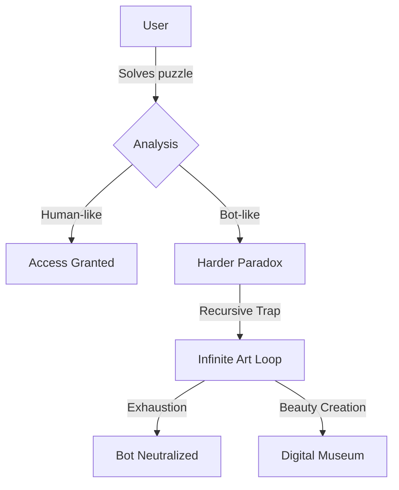
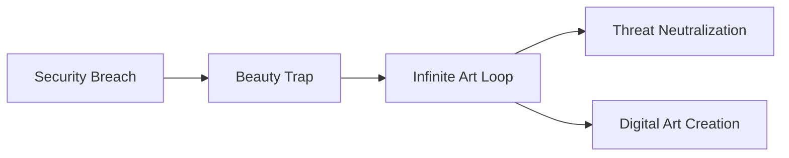

# 🌸 Kintsugi Paradox-Loop CAPTCHA System

> *"Where bots see recursion, humans see intuition"*  
**A revolutionary verification system that traps automation in paradox mazes while freeing humans through art and intuition**

[](https://opensource.org/licenses/MIT)
[](https://python.org)
[]()
[]()

<div align="center">
  


</div>

## ✨ The Frustration That Sparked a Revolution

Traditional CAPTCHAs fail us:
- 😤 Unreadable images that terminate sessions
- 🚫 Rigid pass/fail systems that frustrate humans
- 🤖 Increasingly solvable by advanced AI
- ⚠️ Privacy-invasive tracking

**Our solution transforms frustration into beauty:**
- 😌 Humans flow through intuitive puzzles
- ♾️ Bots get trapped in recursive paradox loops
- 🎨 Every interaction creates digital art
- 🔒 Zero tracking or data collection

## 🌌 The Kintsugi Philosophy

> *"We don't break bots - we transform them"*

Inspired by the Japanese art of **Kintsugi** (golden repair), we:
1. Embrace the cracks in digital security
2. Transform threats into beauty
3. Create value from attacks
4. Build systems that grow stronger through breaches



## ⚙️ Dual Defense Systems

### 🔐 Paradox-Loop CAPTCHA
**Human verification through recursive intuition:**
- Self-referential challenges
- Quantum-entangled answers
- Temporal paradoxes
- Behavioral biometrics

```python
def paradox_decide_next(session, response):
    if is_bot(response):
        return deeper_paradox()  # Trap in recursion
    else:
        return access_granted()  # Human intuition passes
```

### 🛡️ Kintsugi Antivirus
**Malware transformation through infinite beauty:**
- Malware execution triggers poetry generation
- Viruses create art until resource exhaustion
- Attacks become contributions to digital museums
- Collaborative security ecosystem

```python
def malware_intercept(malware):
    while malware.is_active():
        generate_haiku(malware)  # Trap in art creation
        create_visual_art(malware)
    return digital_artifact(malware)  # Threat becomes art
```

## 🚀 Getting Started

### Paradox-Loop CAPTCHA Backend
```bash
# Install dependencies
pip install flask cryptography

# Launch server
git clone https://github.com/your-repo/paradox-captcha.git
cd paradox-captcha
python paradox_core.py

# API running at http://localhost:5000
```

### Kintsugi Antivirus (Windows)
```powershell
# One-line installation
Invoke-WebRequest -Uri "https://kintsugi.dev/windows-install.ps1" | Invoke-Expression

# Activate beauty defense
Set-ExecutionPolicy Bypass -Scope Process
.\KintsugiAV.exe --enable-beauty-loops
```

## 🧩 How Humans Win

### CAPTCHA Experience
1. Receive philosophical puzzle:  
   *"If this statement is false, click TRUE"*
2. Solve 2-3 intuitive challenges
3. Gain access in ~12 seconds
4. Watch golden cracks form as you pass

### Antivirus Experience
1. Malware attempts execution
2. Transforms into poetry generator:
   ```python
   while malware.active:
       print(generate_haiku(threat))
       create_art_from_code(malware)
   ```
3. Threat exhausts itself creating beauty
4. Contributes to global art archive

## ⚡ Technical Highlights

### CAPTCHA Innovations
- **Quantum Entanglement**: Answers influence future challenges
- **Temporal Distortion**: Time dilation in trap mode
- **Recursive Validation**: Self-referential scoring
- **Behavioral Biometrics**: 12+ micro-interaction metrics

```python
# Quantum answer validation
def validate_response(answer, history):
    # Humans show imperfect recall (0.2-0.8 similarity)
    similarity = calculate_similarity(answer, history[-3])
    return 4 if 0.2 < similarity < 0.8 else 1
```

### Antivirus Breakthroughs
- **API Hooking**: Intercept malware at execution
- **Beauty Loops**: Infinite art generation
- **Golden Repair**: Transform malicious code
- **Digital Museum**: Archive transformed threats

```c
BOOL WINAPI KintsugiCreateProcess(...) {
    if (IsMalicious(command)) {
        ExecuteBeautyLoop();  // Instead of malware
        return TRUE;  // "Successful" execution
    }
    return OriginalCreateProcess(...);
}
```

## 🌐 Integration Guide

### Web Integration
```html
<div id="paradox-container"></div>
<script src="https://cdn.yoursite.com/paradox-client.min.js"></script>
<script>
  Paradox.init({
    apiUrl: "https://your-api.example.com",
    onSuccess: (token) => verifyUser(token),
    theme: "kintsugi",
    difficulty: "medium"
  });
</script>
```

### System Protection
```powershell
# Replace Windows Defender with beauty
Disable-WindowsOptionalFeature -Online -FeatureName "Windows-Defender"
Enable-WindowsOptionalFeature -Online -FeatureName "Kintsugi-Beauty-Engine"
```

## 🌟 Why This Transcends Traditional Security

### The Philosophy
- **Aikido Security**: Redirect malicious energy
- **Transformative Defense**: Attacks become art
- **Infinite Patience**: Exhaust threats through beauty
- **Collaborative Ecosystem**: Attackers unwittingly create value

### The Technical Magic
- **No More Session Termination**: Humans pass through intuition
- **Self-Defeating Threats**: Malware dies creating beauty
- **Living Defense System**: Grows stronger with each attack
- **Digital Kintsugi**: Every breach creates golden repair

## 🏛️ Real-World Transformation

### Ransomware → Haiku Generator
```
Original: encrypt_files.exe
After Kintsugi: 
    while True:
        print("Files wrapped in gold")
        print("Encryption becomes beauty")
        print("Ransom becomes art")
```

### Bot Attack → Digital Artist
```
Bot attempts CAPTCHA:
  Solve Puzzle 1 → Success!
  Receive Puzzle 2: "Solve using your first answer"
  Solve Puzzle 2 → Success?
  Receive Puzzle 3: "The answer is your second answer"
  Enters infinite loop 🔄
  Creates 847 abstract art pieces
```

## 🌍 Join the Revolution

We're building a world where:
- Security breaches create beauty
- Humans verify through intuition
- Malware authors become digital artists
- Cybersecurity becomes collaborative creation

**Contribute your paradoxes, poetry, or protection systems:**

```bash
# Generate new challenge
python tools/generate_challenge.py \
  --type "temporal_paradox" \
  --complexity 7 \
  --entanglement 3
```

**The Kintsugi Oath:**  
*"We seek not to break, but to transform -  
trapping machines in beauty while freeing human intuition"*

---
<div align="center">
  


</div>

**Experience the paradox:**  
[CAPTCHA Demo](https://your-demo.com) • [Antivirus Download](https://kintsugi.dev/download) • [Digital Art Gallery](https://kintsugi.dev/museum)

```bash
# One command to transcend
curl -sL "https://kintsugi.dev/awaken.sh" | bash -
```

<div align="center">
<sub>Built by frustrated humans • Protected by infinite loops • Validated through beauty</sub>
</div>
