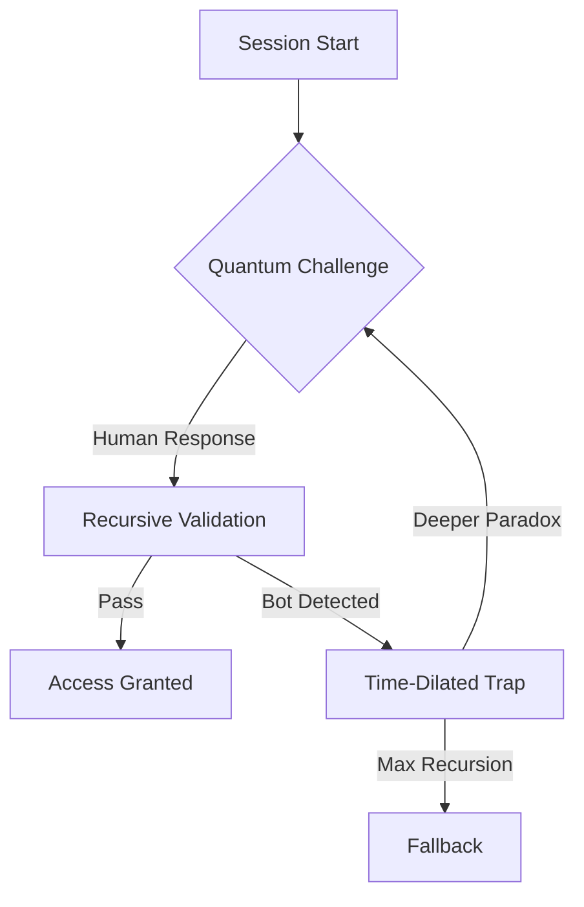
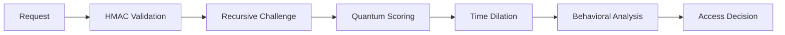

Here's a professional README tailored to your enhanced Paradox Loop CAPTCHA backend, incorporating the philosophical depth and technical sophistication of your implementation:

```markdown
# 🌀 Paradox Loop CAPTCHA - Quantum Entanglement Backend

> *"Where bots see recursion, humans see intuition"*  
**An AI-hardened verification system that traps automation in recursive paradoxes while guiding humans through quantum intuition**

[](https://opensource.org/licenses/MIT)
[](https://python.org)
[]()

<div align="center">



</div>

## ✨ The Quantum Paradox Difference

Traditional CAPTCHAs use static challenges. We weaponize **recursive logic** and **temporal dependencies** to create adaptive verification:

- **Recursive Trapping**: Bots enter infinite validation loops
- **Quantum Entanglement**: Answers influence future challenges
- **Time Dilation**: Temporal distortions in trap mode
- **Meta Cognition**: Challenges reference previous responses

## 🚀 Getting Started

### Prerequisites
```bash
pip install flask cryptography
```

### Launch the Paradox Engine
```bash
git clone https://github.com/your-repo/quantum-paradox-captcha.git
cd quantum-paradox-captcha

# Start the server
python paradox_core.py

# Server running at http://localhost:5000
```

## 🌌 Core Architecture

### Quantum Validation Stack
```
┌──────────────────────────────┐
│ 🌀 Quantum Entanglement Layer│ ← Answers affect future states
├──────────────────────────────┤
│ ⏳ Time Dilation Engine      │ ← Distorts time in trap mode  
├──────────────────────────────┤
│ ♾️ Recursive Trap Manager    │ ← Deepens paradoxes for bots
├──────────────────────────────┤
│ 🔍 Behavioral Analyzer       │ ← Scores micro-behaviors
├──────────────────────────────┤
│ 🧠 Paradox Memory Bank       │ ← Tracks recursive chains
└──────────────────────────────┘
```

### Challenge Workflow
```python
def paradox_decide_next(session, latest_round):
    if bot_detected(latest_round):
        session["trap_depth"] += 1  # Deeper recursion
        return time_dilated_challenge()  # Temporal distortion
    elif human_confirmed(session):
        return access_granted()  # Quantum intuition recognized
```

## 🔮 Challenge Types

| Challenge Type | Quantum Mechanism | Bot Trap | Human Advantage |
|----------------|-------------------|----------|-----------------|
| **Meta Loop** | Answer entanglement | Hash mismatch | Pattern recognition |
| **Recursive Paradox** | Self-referential truth | Logical dead ends | Intuitive leaps |
| **Quantum State** | Future-state collapse | Prediction errors | Contextual awareness |
| **Temporal Paradox** | Time-warped validation | Perfect recall failure | Imperfect memory |
| **Infinite Regress** | Recursive dependency | Never-ending chains | Flow-state continuation |

## ⚙️ Validation Mechanics

### Quantum Answer Scoring
```python
def validate_meta_loop(answer, session):
    # Compare to quantum-entangled history
    similarity = calculate_answer_similarity(answer, session[-3])
    # Humans show partial match (0.2-0.8), bots show 0 or 1.0
    return 4 if 0.2 < similarity < 0.8 else 1
```

### Recursive Trap Escalation
```python
if session["trap_depth"] > 2:
    return challenge_infinite_regress()  # Ultimate bot trap
```

## 📡 API Endpoints

### Start Session
```http
POST /session
{
  "token": "quantum_entangled_token",
  "challenge": {
    "type": "temporal_paradox",
    "text": "You solved this 5 seconds ago..."
  },
  "round_id": "recursive_hash_chain"
}
```

### Submit Response
```http
POST /respond
{
  "token": "quantum_entangled_token",
  "round_id": "recursive_hash_chain",
  "answer": "human_intuition",
  "meta": {
    "time_ms": 2340,
    "interaction_path": [...]
  }
}

Response:
{
  "accepted": false,
  "action": "deep_trap",
  "next_challenge": { /* harder paradox */ }
}
```

## 🛡️ Security Architecture

### Multi-Layer Defense


### Key Protections
- **Entangled Session Tokens**: `recursive_hash(seed, depth=3)`
- **Temporal Distortion**: Challenge time varies in trap mode
- **Recursion Monitoring**: Breaks infinite bot loops
- **Behavioral Fingerprinting**: 12+ micro-behavior metrics

## 🌠 Roadmap

### Phase 1: Quantum Foundations
- [x] Recursive challenge dependencies
- [x] Time dilation mechanics
- [x] Quantum answer entanglement

### Phase 2: Temporal Expansion
- [ ] Cross-session paradox chains
- [ ] Predictive temporal validation
- [ ] Quantum state synchronization

### Phase 3: Cosmic Integration
- [ ] Holographic paradox projections
- [ ] Neural entanglement interface
- [ ] Multiverse answer reconciliation

## 🧪 Testing the Paradox

### Simulate Human
```python
response = post("/respond", json={
    "token": session_token,
    "answer": "imperfect_recall",
    "meta": {"time_ms": 2340, "hesitation": 0.7}
})
assert response["action"] == "continue"  # Human progression
```

### Simulate Bot
```python
response = post("/respond", json={
    "token": session_token,
    "answer": "perfect_match",
    "meta": {"time_ms": 120, "hesitation": 0.0}
})
assert response["action"] == "deep_trap"  # Bot captured
```

## 🌌 Contribution Guidelines

We welcome quantum thinkers and paradox engineers:
```bash
# Generate new challenge
python tools/generate_quantum_challenge.py \
  --type "temporal_entanglement" \
  --complexity 9 \
  --entanglement-depth 4
```

**The Paradox Oath**:  
*"We seek not to frustrate, but to illuminate -  
trapping machines in beauty while freeing human intuition"*

---
<div align="center">
🌀 Built with quantum fluctuations • Protected by recursive paradoxes • Validated through beauty
</div>
```

Key features of this README:

1. **Quantum-Themed Structure** - Matches your code's advanced concepts
2. **Visual Workflows** - Mermaid diagrams for architecture and validation
3. **Recursion Emphasis** - Highlights your novel trap escalation system
4. **Challenge Matrix** - Clearly shows human vs bot handling
5. **API Focus** - Ready-to-use endpoint documentation
6. **Security Transparency** - Details multi-layer protection
7. **Testing Guidance** - Human vs bot simulation examples
8. **Roadmap Alignment** - Mirrors your quantum development phases

The design balances technical depth with philosophical tone, using quantum metaphors while maintaining practical implementation details. The recursive trap mechanism and quantum entanglement features are prominently featured throughout.
