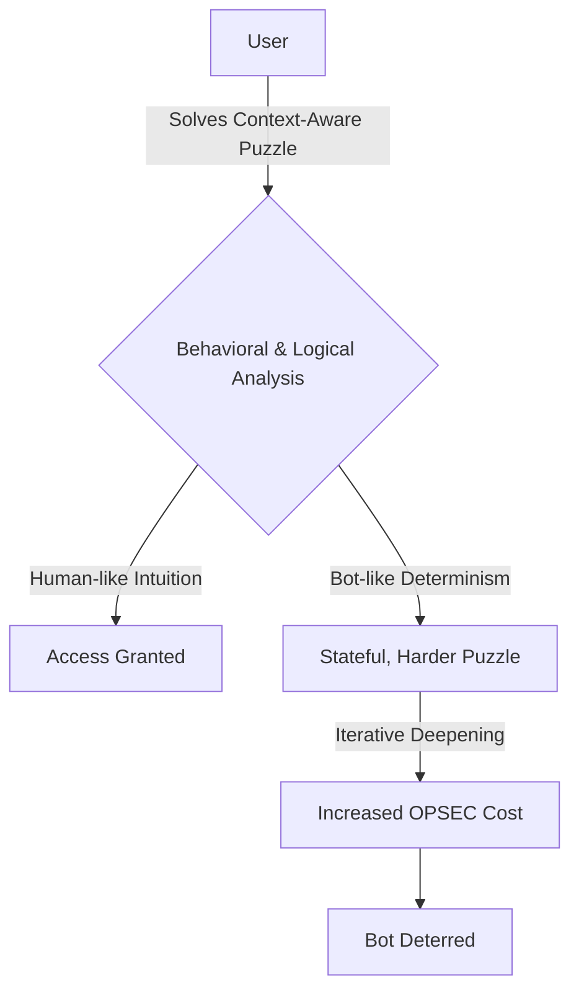

<div align="center">

# 🌸✨ **K I N T S U G I   P A R A D O X** ✨🌸
### 🛡️⚔️ *A Research Initiative into Transformative Security* ⚔️🛡️

</div>

---

<div align="center">

## 💫 *"We don't break threats—we transform them. Where bots see recursion, humans see intuition."* 💫

</div>

---

🏷️ **License:** MIT  
⚡ **Research Status:** 🟢 Active  
🔬 **Phase:** 🤖 CAPTCHA Prototype

## 🏗️⚙️ **S Y S T E M   A R C H I T E C T U R E** ⚙️🏗️



## ✨🌟 **T H E   V I S I O N:** *Transcending Traditional Security* 🌟✨

Traditional security is a brittle, adversarial arms race. We believe in a paradigm inspired by **🏺✨ Kintsugi (金継ぎ) ✨🏺**, the Japanese art of golden repair:

- 🤗 **Embrace Breaches:** Treat security events as information, not just failures.
- 🔄💫 **Transform Energy:** Redirect malicious intent into productive or beautiful outcomes.  
- 🏗️💪 **Build Resilience:** Create systems that grow stronger and more adaptive through attempted attacks.

This repository is the home for our experiments into making this philosophy a computational reality. 🌈🔬

## 🔬🧪 **A C T I V E   R E S E A R C H   T R A C K S** 🧪🔬

### 🌀🧩 **1. Paradox-Loop CAPTCHA** *(Prototype Phase)* 🧩🌀
A stateful, context-aware verification system designed to be intuitively solvable by humans while exponentially costly for bots to solve at scale.

- 🎯 **Core Principle:** Uses a sequence of self-referential and logic-based puzzles.
- 👤💭 **Human Experience:** Feels like a quick, engaging game of intuition.
- 🤖⚡ **Bot Experience:** Faces an increasingly complex decision tree, making automated solving resource-prohibitive.
- 🎯✨ **Goal:** Replace frustrating image-based CAPTCHAs with a respectful, privacy-centric alternative.

### 🛡️🔮 **2. Kintsugi Anti-Malware** *(Theoretical Phase)* 🔮🛡️
A speculative framework for a new class of defensive systems.

- 🎯 **Core Principle:** Intercept and analyze malicious code within a high-interaction sandbox.
- 🎨🔍 **Transformative Output:** Systematically analyze the code's behavior to generate unique fingerprints (e.g., visual hashes, procedural poetry) for threat intelligence.
- 🌟 **Goal:** Shift from simply blocking threats to learning from them and enriching collective security knowledge.

## 🚀🛠️ **G E T T I N G   S T A R T E D** *with the CAPTCHA Prototype* 🛠️🚀

The CAPTCHA module is our first tangible step toward this vision. You can run the alpha prototype locally. 🏃‍♂️💨

```bash
# Clone the repository
git clone https://github.com/your-username/kintsugi-paradox.git
cd kintsugi-paradox/paradox-captcha

# Install dependencies (Python 3.8+ required)
pip install -r requirements.txt

# Launch the development server
python app.py
```

The API server will start at `http://localhost:5000`. Visit the endpoint to experience a prototype puzzle sequence. 🎮✨

## 🧩🎭 **H O W   I T   W O R K S:** *The Philosophy in Practice* 🎭🧩

### 👤💡 **For Humans:**
1. 🧠 You receive a logical or linguistic puzzle (e.g., "Which word does not belong: time, paradox, clock, intuition?").
2. 🎯 Your answer influences the next puzzle in a non-linear sequence.
3. ✨ Your pattern of intuition is recognized, and access is granted swiftly.

### 🤖⚙️ **For Bots:**
1. 🎲 A bot provides a correct but deterministic answer.
2. 🔄 The system presents a new puzzle whose parameters are based on the previous answer.
3. 📈 The bot must now solve a new, stateful problem, increasing its computational overhead with each step.
4. 💸⛔ The cost of solving the entire sequence for a large-scale attack becomes prohibitive.

## 🗺️🛤️ **R E S E A R C H   R O A D M A P** 🛤️🗺️

| 📅 Phase | 🎯 Focus | 📊 Status |
|-------|-------|---------|
| 🅰️ Phase 1 α | Core Paradox CAPTCHA Engine | ✅ Active Development |
| 🅱️ Phase 1 β | User Experience Studies & Tuning | 🚧 Planned |
| 🏁 Phase 1 RC | Public Demo & Beta Testing | 🔜 Future |
| 2️⃣ Phase 2 | Formalized "Beauty as Countermeasure" Framework | 📚 Theoretical |
| 3️⃣ Phase 3 | Kintsugi AV Research & PoCs | 📚 Theoretical |

## 🌍🤝 **J O I N   T H E   R E S E A R C H   I N I T I A T I V E** 🤝🌍

We are looking for collaborators who are passionate about: 💫
- 👥🛡️ **Human-Centered Security**
- 🎮🧠 **Game Theory & Adversarial ML**
- 🎨💻 **Creative Computing & Generative Art**
- 🤔⚙️ **Philosophy of Technology**

### 🚀 **How to contribute:**
1. 🧪 **Experiment with the Prototype:** Run the alpha, break it, and open issues with your findings.
2. 🧩 **Propose New Puzzle Types:** Help us design clever, intuitive puzzles in the `/paradox-captcha/puzzle_types` directory.
3. 📝 **Develop Theory:** Contribute to our white papers and design documents in the `/research` directory.

## 🏺✨ **T H E   K I N T S U G I   O A T H** ✨🏺
### 💫 *"We seek not to break, but to understand. Not to repel, but to transform. We are building a more resilient, beautiful, and intuitive digital world."* 💫

---

<div align="center">


</div>

**🔍✨ Explore the vision:**  
🔗 [ 📜 Research Paper Draft ] • [ 🤝 Contribution Guidelines ]

### ⚡🚀 **Quick Start**
```bash
# One line to start exploring (CAPTCHA prototype)
git clone https://github.com/your-username/kintsugi-paradox.git && cd kintsugi-paradox/paradox-captcha && pip install -r requirements.txt && python app.py
```

<div align="center">
<sub>🏗️ Built by open-source contributors • 🛡️ Protected by elegant logic • ✅ Validated through collaboration 🌟</sub>
</div>
