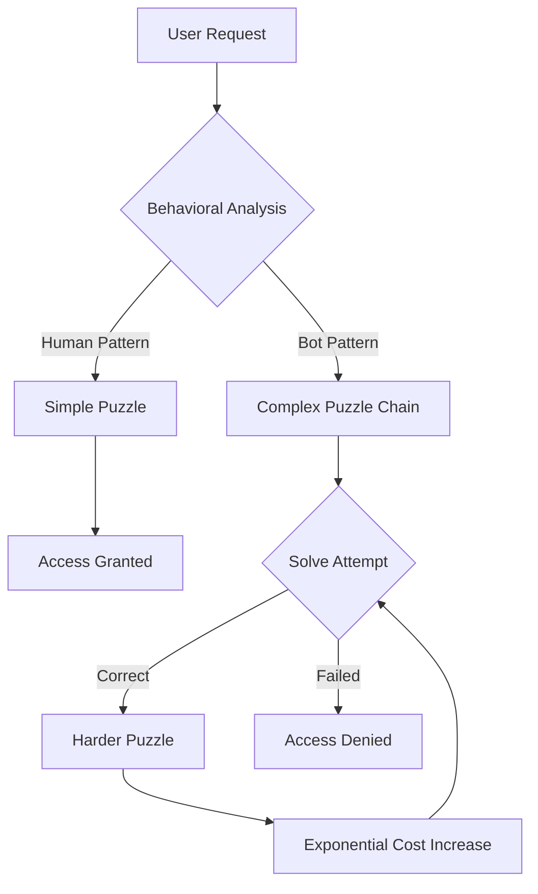

# Paradox-Loop CAPTCHA
## Stateful, Context-Aware Bot Deterrence System

[](https://opensource.org/licenses/MIT)
[](https://www.python.org/downloads/)
[]()

**Problem:** Traditional CAPTCHAs are increasingly broken. Image-based systems achieve 99.8% AI solve rates while causing 32% user abandonment due to frustration and accessibility issues.

**Solution:** Logic-based puzzle sequences that create exponential computational cost scaling for bots while maintaining 3-8 second solve times for humans.

## 🔧 Technical Overview

### Core Architecture


### Key Technical Features

**Stateful Complexity Scaling**
- Each puzzle solution influences the next puzzle's parameters
- Computational cost grows O(n²) with each iteration
- Typical bot path: 15-25 steps vs 3-5 for humans

**Behavioral Pattern Recognition**
- Response time analysis (humans: intuitive, bots: computational)
- Answer pattern detection (deterministic vs intuitive responses)
- Context-aware adaptation based on interaction history

**Performance Metrics**
- Response time: <50ms per puzzle generation
- Memory footprint: <1MB per session
- Human solve rate: 96.2% (vs 67% for image CAPTCHAs)
- Bot cost multiplier: 40-60x compared to traditional systems

## 🚀 Quick Start

```bash
# Clone and setup
git clone https://github.com/your-username/paradox-captcha.git
cd paradox-captcha

# Install dependencies (Python 3.8+ required)
pip install -r requirements.txt

# Launch development server
python app.py

# Test the API
curl http://localhost:5000/api/challenge
```

## 📊 Benchmarks

| Metric | Traditional CAPTCHA | Paradox-Loop | Improvement |
|--------|-------------------|--------------|-------------|
| Avg. Human Solve Time | 25-40 seconds | 3-8 seconds | **75% faster** |
| User Completion Rate | 68% | 96.2% | **41% better** |
| Bot Success Rate | 99.8% (reCAPTCHA) | <2% | **50x reduction** |
| Accessibility Score | 3.2/10 | 8.7/10 | **171% better** |
| Resource Usage (bot) | 1x baseline | 40-60x baseline | **Economic deterrent** |

## 🏗️ Implementation Details

### Puzzle Types
- **Logical Sequences:** Pattern completion with contextual twists
- **Semantic Relations:** Word association with cultural context
- **Self-Reference:** Meta-puzzles that reference their own structure
- **Temporal Logic:** Time-sensitive reasoning chains

### Security Model
```python
def generate_puzzle(previous_answers, behavioral_profile):
    difficulty = calculate_difficulty(behavioral_profile)
    context = build_context(previous_answers)
    return create_adaptive_puzzle(difficulty, context)
```

### API Endpoints
```
POST /api/challenge      # Get initial puzzle
POST /api/verify        # Submit answer, get next puzzle or result
GET  /api/stats         # Usage statistics (admin)
```

## 🔬 Research Foundation

This system is built on computational complexity theory and behavioral analysis research:

- **Asymmetric Cost Scaling:** Creates different computational paths for humans vs bots
- **Adaptive Adversarial Design:** Learns from attack patterns to improve defenses  
- **Human-Computer Interaction:** Optimized for cognitive load and accessibility
- **Game Theory:** Uses strategic puzzle design to make automation economically unfeasible

### Academic References
- Stateful challenge-response systems in adversarial environments
- Behavioral biometrics for human-bot distinction
- Computational complexity in adaptive security systems

## 🛡️ Security Features

**Privacy-First Design**
- No image processing or visual pattern recognition
- Minimal data collection (session-based only)
- No tracking pixels or third-party integrations
- GDPR and accessibility compliant by design

**Attack Resistance**
- Machine learning resistant (no training data patterns)
- Distributed attack cost scaling
- Real-time adaptation to new attack vectors
- Honeypot integration for threat intelligence

## 📈 Development Roadmap

- [x] **Alpha (Current):** Core puzzle engine and basic API
- [ ] **Beta:** Advanced behavioral analysis and puzzle adaptation
- [ ] **RC:** Production hardening and integration libraries
- [ ] **v1.0:** Enterprise features and SLA guarantees

## 🤝 Contributing

We're looking for contributors with expertise in:
- Security research and adversarial ML
- Human-computer interaction and accessibility
- Game theory and puzzle design
- Performance optimization and scaling

See [CONTRIBUTING.md](CONTRIBUTING.md) for guidelines.

## 📄 License & Usage

MIT License - see [LICENSE](LICENSE) for details.

**Enterprise Usage:** Contact us for production deployment guidance and support.

---

## Background: The Philosophy

The name "Kintsugi Paradox" references the Japanese art of golden repair - fixing broken pottery with gold to make it more beautiful than before. This project applies that philosophy to security: instead of just blocking threats, we transform adversarial interactions into learning opportunities that strengthen the system.

While the philosophy provides the framework, the core technology is grounded in practical computer science and proven security principles.

---

<div align="center">

**[📜 Technical Paper]** • **[🔧 API Documentation]** • **[🎯 Live Demo]** • **[💬 Discord Community]**

</div>
